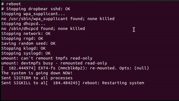

# Micro WiPi
Micro WiPi is a Wifi enabled minimum config for RPi Zero W on Buildroot!

It takes the form of some minimal additional packgages added to the
buildroot defconfig and just the necessary rootfs overlay in order to
get wifi working on an otherwise completley bare-bones system image.

The end result is an sd card image that will boot on a Raspberry Pi Zero W 
and be able to ping servers in about 12 seconds.



# Installing

```bash
# Clone this repo and cd to it
~$ git clone https://github.com/jonmon6691/uwipi.git
~$ cd uwipi

# Clone buildroot
~/uwipi$ git clone git://git.buildroot.net/buildroot

# Apply Micro WiPi to the buildroot tree, this only touches
# raspberrypi related stuff
~/uwipi$ ./install_uwipi.sh

# cd into buildroot and load the defconfig like normal
~/uwipi$ cd buildroot
~/uwipi/buildroot$ make raspberrypi0w_defconfig

# OPTIONAL: At this point, you can customize your buildroot configuration,
# add packages, etc.
~/uwipi/buildroot$ make menuconfig

# Build the image, this will take a long time as it builds the tool chain,
# kernel, and everything else...
~/uwipi/buildroot$ make

# A flashing script is also provided
~/uwipi/buildroot$ cd ..
~/uwipi$ ./flash.sh sdc #NOTE!! replace sdc with the root device of your sd card
```

# Changing the WiFi network
``` bash
~/uwipi$ ./configure_wifi.sh
SSID: NETGEAR_404
PASSWORD: 

Updated: rootfs_overlay/etc/wpa_supplicant.conf
Updated: buildroot/board/raspberrypi0w/rootfs_overlay/etc/wpa_supplicant.conf

# Done! You can either copy the wpa_supplicant.conf file to /etc on an already
# flashed SD card, or run make inside buildroot, and flash the new image and
# your new WiFi settings will be set.

```
## Notes:
* Change the root password for obvious security resons! Buildroot does not add
any users by default, so unless you add any, you must log in using root. 
The buildroot default is not to have a root password, but to enable SSH,
uWiPi makes the root password "buildroot" by default. 
* Currently only works with SysV init system, if you enable systemd then you'll need to provide your own wpa\_supplicant.service

